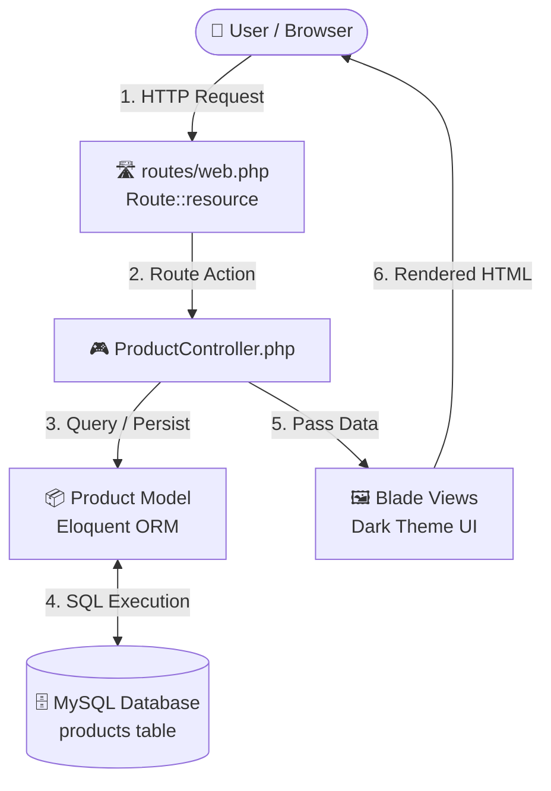

# 🛒 Laravel Product CRUD Application

[](https://laravel.com)
[](https://www.php.net)
[](https://www.mysql.com)
[](LICENSE)

> **Academic Submission:** Activity No. 2 — Creating CRUD Modules in Laravel  
> **Course:** CCC181: Web Systems and Technologies  
> **Architecture:** Model-View-Controller (MVC)

---

## 📖 Overview

This repository contains a full-stack **Product Management Web Application** built using **Laravel 12** and **MySQL**. It demonstrates fundamental backend engineering concepts, including database migrations, Eloquent Object-Relational Mapping (ORM), RESTful routing, mass-assignment protection, form request validation, and server-rendered dynamic Blade views with a custom **Dark Mode UI**.

---

## ✨ Features

- 🟢 **Create Products:** Form validation for product name, quantity, price, and optional description.
- 📋 **Read / List Products:** Dynamic tabular list displaying records, prices formatted in currency, and quantity badges.
- 🟡 **Update Products:** Pre-populated editing forms using HTTP method spoofing (`@method('PUT')`).
- 🔴 **Delete Products:** Confirmation-prompted deletion using HTTP method spoofing (`@method('DELETE')`).
- 🌙 **Dark Mode UI:** Modern dark slate design system (`#0f172a` / `#1e293b`) with smooth transitions and glowing focus indicators — built strictly with vanilla CSS (no heavy external UI frameworks).
- 🛡️ **Security Built-In:**
  - Cross-Site Request Forgery (CSRF) protection on all form submissions.
  - Mass assignment vulnerability mitigation using `$fillable`.
  - Server-side validation rules preventing invalid or negative inputs.
  - Safe 404 handling using `findOrFail()`.

---

## 🏗️ Architecture & Data Flow

The project follows the standard **Model-View-Controller (MVC)** architectural pattern:



---

## 🛠️ Tech Stack

| Layer | Technology |
|---|---|
| **Backend Framework** | Laravel 12 |
| **Language** | PHP 8.2+ |
| **Database** | MySQL 8.0+ |
| **ORM** | Eloquent ORM |
| **Templating Engine** | Blade |
| **Styling** | Custom Vanilla CSS (Modern Dark Palette) |

---

## 📂 Project Structure

Key customized files implementing the CRUD system:

```text
CCC181-LAB2/
├── .env                                         # Database & environment configurations
├── app/
│   ├── Http/
│   │   └── Controllers/
│   │       └── ProductController.php           # CRUD business logic & validation
│   └── Models/
│       └── Product.php                          # Eloquent Model with $fillable attributes
├── database/
│   └── migrations/
│       └── 2026_09_19_112146_create_products_table.php # Database schema definition
├── resources/
│   └── views/
│       └── products/
│           ├── index.blade.php                  # Product listing table & actions
│           ├── create.blade.php                 # Add product form
│           └── edit.blade.php                   # Edit product form
└── routes/
    └── web.php                                  # RESTful resource routing
```

---

## 🗄️ Database Schema

The `products` table schema generated via Laravel migrations:

| Column | Data Type | Attributes | Description |
|---|---|---|---|
| `id` | `BIGINT` | Primary Key, Auto Increment, Unsigned | Unique product identifier |
| `name` | `VARCHAR(255)` | Not Null | Product name |
| `qty` | `INT` | Not Null | Stock quantity |
| `price` | `DECIMAL(8,2)` | Not Null | Product price with 2 decimal places |
| `description` | `TEXT` | Nullable | Optional product description |
| `created_at` | `TIMESTAMP` | Nullable | Creation timestamp (auto-managed) |
| `updated_at` | `TIMESTAMP` | Nullable | Last update timestamp (auto-managed) |

---

## 🛣️ RESTful Route Map

All product routes are registered using `Route::resource('products', ProductController::class)`:

| HTTP Method | URI Path | Controller Method | Route Name | Description |
|:---:|:---:|:---:|:---:|:---|
| `GET` | `/products` | `index()` | `products.index` | Display the product list |
| `GET` | `/products/create` | `create()` | `products.create` | Render the "Add Product" form |
| `POST` | `/products` | `store()` | `products.store` | Validate and store new product |
| `GET` | `/products/{id}/edit` | `edit()` | `products.edit` | Render the pre-populated edit form |
| `PUT` / `PATCH` | `/products/{id}` | `update()` | `products.update` | Validate and update existing product |
| `DELETE` | `/products/{id}` | `destroy()` | `products.destroy` | Delete product from database |

> **Note:** The root route `/` automatically redirects to `/products`.

---

## 🚀 Getting Started / Installation Guide

Follow these steps to set up and run the application locally.

### 1. Prerequisites
Ensure you have the following installed:
- [PHP](https://www.php.net/) >= 8.2
- [Composer](https://getcomposer.org/)
- [MySQL](https://www.mysql.com/) (or XAMPP / MariaDB)

---

### 2. Setup MySQL Service & Database
Start your local MySQL service (e.g., via XAMPP Control Panel or terminal as Administrator):

```powershell
# Start MySQL Service (Windows Service)
net start MySQL80

# Create the application database
mysql -u root -p -e "CREATE DATABASE IF NOT EXISTS \`app-crud\`;"
```

---

### 3. Environment Configuration
Verify your `.env` file matches your local database credentials:

```env
DB_CONNECTION=mysql
DB_HOST=127.0.0.1
DB_PORT=3306
DB_DATABASE=app-crud
DB_USERNAME=root
DB_PASSWORD=
```

---

### 4. Install Dependencies & Run Migrations

```powershell
# Install Composer dependencies (if setting up on a new machine)
composer install

# Generate application key (if not already set)
php artisan key:generate

# Run migrations to generate the database tables
php artisan migrate
```

---

### 5. Launch the Development Server

```powershell
php artisan serve
```

Once running, navigate to **[http://127.0.0.1:8000](http://127.0.0.1:8000)** in your web browser.

---

## 🎨 UI & Design Highlights

The user interface was crafted with modern **Dark Mode UI principles**:

- **Color Harmony:** Deep slate page canvas (`#0f172a`) paired with elevated container cards (`#1e293b`) and border highlights (`#334155`).
- **Accent Palette:**
  - 🟢 **Emerald (`#10b981`):** Add & Save actions + success banners
  - 🔵 **Vibrant Blue (`#3b82f6`):** Edit actions & focus outlines
  - 🔴 **Coral Red (`#ef4444`):** Delete actions & validation alerts
  - ⚪ **Slate Gray (`#64748b`):** Cancel & secondary buttons
- **Micro-Interactions:** Subtle hover transitions, button press feedback (`transform: scale(0.97)`), and badge highlights for stock quantities.

---

## 🧠 Key Laravel Concepts Demonstrated

### 1. Mass Assignment Protection (`$fillable`)
```php
protected $fillable = ['name', 'qty', 'price', 'description'];
```
Protects against malicious users injecting unallowed parameters by restricting which fields can be assigned through `Product::create()` or `$product->update()`.

### 2. HTTP Method Spoofing
HTML forms natively only support `GET` and `POST`. Laravel overcomes this limitation through the `@method('PUT')` and `@method('DELETE')` directives, which inject a hidden `_method` field into the request payload.

### 3. CSRF Protection
```html
<form action="..." method="POST">
    @csrf
    ...
</form>
```
The `@csrf` directive generates a cryptographically secure token checked against the user session to prevent Cross-Site Request Forgery attacks.

### 4. Input Validation
```php
$request->validate([
    'name'  => 'required|string|max:255',
    'qty'   => 'required|integer|min:0',
    'price' => 'required|numeric|min:0',
]);
```
Ensures incoming data adheres to business logic before persistence, automatically redirecting back with `$errors` on failure.

---

## 👤 Author & Academic Details

- **Student / Developer:** Computer Science Student
- **Course:** CCC181 (Web Systems and Technologies)
- **Activity:** Activity No. 2 — Creating CRUD Modules in Laravel
- **Term:** 1st Semester, A.Y. 2026–2027

---

## 📄 License

This project was developed for educational purposes under the [MIT License](LICENSE).


